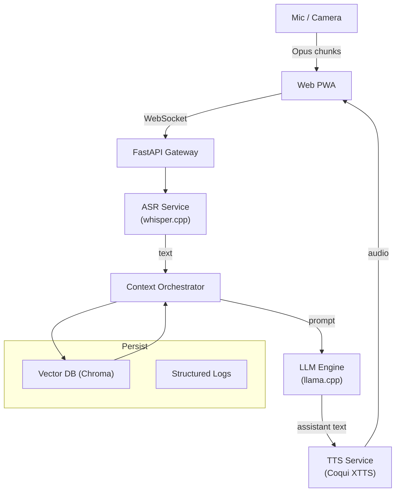

# AI Agent Project – Technical Specification & Development Plan

> **Audience**: Senior/Lead engineers who will review or assist this project
>
> **Status**: Draft v0.1 (June 1 2025)

---

## Table of Contents

1. [Overview](#overview)
2. [Objectives & Use‑Cases](#objectives--use‑cases)
3. [System Architecture](#system-architecture)
4. [Technology Stack](#technology-stack)
5. [Module Breakdown](#module-breakdown)
6. [Deployment Topology](#deployment-topology)
7. [Scalability & Performance](#scalability--performance)
8. [Development Milestones](#development-milestones)
9. [API Contracts (β)](#api-contracts-β)
10. [Risks & Mitigation](#risks--mitigation)
11. [Future Roadmap](#future-roadmap)
12. [Appendix & References](#appendix--references)

---

## Overview

The **AI Agent Project** aims to create a locally‑run, real‑time multimodal agent that can:

* Engage in low‑latency spoken conversation (bi‑directional streaming).
* Provide **course‑work assistance** via Retrieval‑Augmented Generation (RAG) over personal study material.
* Maintain **persistent memory** of personal notes, diary entries, and user preferences.

All heavy inference (ASR ➜ LLM ➜ TTS) runs **on‑device** (Apple Silicon Mac mini, 24 GB unified RAM) to guarantee privacy, with optional cloud fallbacks for premium TTS or larger LLMs.

## Objectives & Use‑Cases

| Priority | Scenario                                 | KPI                                   |
| -------- | ---------------------------------------- | ------------------------------------- |
| P0       | **Spoken Q\&A** on physics homework      | < 1.2 s round‑trip latency            |
| P0       | Personalized study hints (RAG over PDFs) | ≥ 85 % answer relevance (manual eval) |
| P1       | Casual chit‑chat persona switch          | Persona swap ≤ 50 ms                  |
| P2       | Emotion‑aware TTS voice style            | Subjective “naturalness” ≥ 4/5        |

## System Architecture

### 3.1 High‑Level Diagram



### 3.2 Data Flow

1. **Client** captures 16‑kHz PCM → dé‑noised → Opus frames.
2. Frames streamed via WebSocket to **ASR**; encoded text emitted incrementally (token ≤ 40 ms).
3. **Context Orchestrator** merges text with conversation history, retrieves top‑k context chunks from **Chroma** (cosine sim).
4. Consolidated prompt forwarded to **LLM Engine**; streaming tokens returned.
5. Assistant text piped to **TTS**, generating incremental audio.
6. Audio pushed back to client; UI plays with < 300 ms buffer.

---

## Technology Stack

| Layer             | Component                                                             | Rationale                                      | Notes                                                                                                                                |
| ----------------- | --------------------------------------------------------------------- | ---------------------------------------------- | ------------------------------------------------------------------------------------------------------------------------------------ |
| **ASR**           | `whisper.cpp` + Core ML acceleration                                  | Local, x3 CPU speed‑up on ANE cores            | ([github.com](https://github.com/ggml-org/whisper.cpp?utm_source=chatgpt.com))                                                       |
| **LLM**           | `llama.cpp` (quantized **Llama‑3 8B Q4\_0**)                          | Fits 24 GB RAM, proven \~20‑25 tok/s on M2 Pro | ([github.com](https://github.com/ggml-org/llama.cpp/discussions/4167?utm_source=chatgpt.com))                                        |
| **Embedding**     | `sentence-transformers` e5‑small (or OpenAI `text-embedding‑3‑small`) | Trade‑off size vs. quality                     |                                                                                                                                      |
| **Vector Store**  | `Chroma` (duckdb mode off; SQLite persist)                            | Zero‑config local file; instant spin‑up        | ([medium.com](https://medium.com/%40hasinivijayarathna/creating-a-vector-database-using-chroma-956b1d84aca3?utm_source=chatgpt.com)) |
| **TTS**           | `coqui‑XTTS‑v2` (fallback ElevenLabs)                                 | Multi‑lingual voice‑cloning; fully offline     | ([huggingface.co](https://huggingface.co/coqui/XTTS-v2?utm_source=chatgpt.com))                                                      |
| **API**           | FastAPI + Uvicorn + WebSocket                                         | Async streaming; minimal overhead              |                                                                                                                                      |
| **Client**        | Next.js (PWA, Vite, TS)                                               | Offline‑capable, Web Audio, future WebRTC      |                                                                                                                                      |
| **DevOps**        | Poetry, GitHub Actions, Docker                                        | Reproducible, CI lint/test/build               |                                                                                                                                      |
| **Observability** | `structlog`, Promtail → Grafana Loki                                  | Structured, searchable logs                    |                                                                                                                                      |

---

## Module Breakdown

### 5.1 ASR Service

* **Model prep**: `make build-whisper-coreml` converts OpenAI tiny.en to Core ML (*\~90 MB*).
* **Runtime**: C‑shared lib wrapped by Python (ctypes) streaming API.
* **Output**: JSON lines `{timestamp, text}`; WER target < 8 % on academic recordings.

### 5.2 LLM Inference Engine

* **Quantization**: `llama.cpp --quantize q4_0` to minimize memory.
* **Prompt Template (RAG)**:

  ```text
  <s>[INST] <<SYS>>
  You are StudyBuddy v0.1...
  <CONTEXT>
  {retrieved_chunks}
  </CONTEXT>
  <STUDENT>{user_input}[/INST]
  ```
* **Streaming**: `--interactive --log-disable` pipes tokens to orchestrator.

### 5.3 Retrieval Layer (RAG)

* **Ingest pipeline**: PDF → `pymupdf` → markdown → `tiktoken` chunk (max 512 tokens) → embed.
* **Chroma schema**: `{id, text, source, page_no, emb: float[768]}`.
* **Similarity**: `cosine` + **MMR** to diversify.

### 5.4 Memory Store

* Diary & preference JSON stored as plain docs in same Chroma collection with tag `type="memory"`.
* Periodic consolidation: daily LangChain `SQLDatabaseChain` summarises yesterday’s chat and embeds.

### 5.5 TTS Service

* `xtts-server.py` runs as gRPC micro‑service; supports **voice cloning** via 6‑second reference clip.
* Fallback: ElevenLabs REST if local CPU RTT > 1500 ms.

### 5.6 Gateway & Real‑time Bridge

* **FastAPI** routes:

  | Verb   | Path             | Desc                       |
  | ------ | ---------------- | -------------------------- |
  | `WS`   | `/ws/audio`      | bidirectional audio stream |
  | `GET`  | `/v1/health`     | readiness probe            |
  | `POST` | `/v1/rag/ingest` | ingest new doc             |

### 5.7 Frontend PWA

* Service Worker caches JS & WASM for offline startup.
* Web Audio API: `MediaRecorder` (opus) & `AudioWorklet` playback.
* UI state via Redux Toolkit; persona selector & transcript pane.

### 5.8 Observability

* `structlog` → JSON; Promtail tails logs → Loki; dashboard gives latency heatmap (ASR/LLM/TTS).

### 5.9 Security & Privacy

* All files stored under `$HOME/.ai-agent/`; optional GPG encryption.
* Outbound requests (cloud fallback) pass through allow‑list middleware.

---

## Deployment Topology

| Environment          | Container Orchestration                  | Notes                                         |
| -------------------- | ---------------------------------------- | --------------------------------------------- |
| **Local dev**        | `make dev` (start all modules with tmux) | Direct host CUDA/Core ML                      |
| **Prod single‑node** | Docker‑compose (6 services)              | Volumes: `models/`, `db/`                     |
| **Cloud failover**   | (Optional) Fly.io 2 × shared‑CPU         | Build arg `CLOUD=true` disables local LLM/TTS |

---

## Scalability & Performance

* **ASR** @ 16‑kHz tiny.en ≈ 25 × RTF on M2 (ANE) — headroom ×20.
* **LLM** 8B Q4\_0 ≈ 22 tok/s (bench batch 512) — target user latency achievable.
* **Memory use**: 8B Q4\_0 model \~ 3.8 GB; embeddings small; total fits in 24 GB.
* **Bottlenecks**: WebSocket back‑pressure if TTS > ASR; mitigated by adaptive chunking.

---

## Development Milestones

| ID | Deliverable             | Issues Closed | ETA        |
| -- | ----------------------- | ------------- | ---------- |
| M0 | `make setup` + CI green | #1, #2        | 2025‑06‑07 |
| M1 | CLI voice demo          | #3–#6         | 2025‑06‑14 |
| M2 | PWA streaming           | #7–#12        | 2025‑06‑24 |
| M3 | RAG homework mode       | #13–#18       | 2025‑07‑05 |
| M4 | Persistent memory v1    | #19–#23       | 2025‑07‑15 |

---

## API Contracts (β)

Full OpenAPI v3 spec will live in `/docs/openapi.yaml`. Selected excerpt:

```yaml
paths:
  /v1/rag/ingest:
    post:
      summary: Ingest a file or text.
      requestBody:
        multipart/form-data:
          file: binary
          meta: string
      responses:
        "200": { description: "OK" }
  /ws/audio:
    get:
      x-websocket: true
      description: Bidirectional OPUS frames (48 kHz, 20 ms).
```

---

## Risks & Mitigation

| Risk                                  | Likelihood | Impact | Action                                |
| ------------------------------------- | ---------- | ------ | ------------------------------------- |
| LLM hallucination on academic answers | Med        | High   | RAG + source citing; prompt guardrail |
| ASR noise in dorm environment         | High       | Med    | RNNoise pre‑filter; VAD gating        |
| Memory bloat of chat logs             | Med        | Med    | Daily summarisation + TTL             |
| Apple Core ML API changes             | Low        | Med    | Maintain CPU fallback binary          |

---

## Future Roadmap

* **Emotion detection** via MFCC → CNN; adjust TTS prosody.
* **Avatar rendering** (Live2D → WebGPU glTF 3D).
* **IoT integration** (HomeKit over BLE) after PWA stable.

---

## Appendix & References

1. whisper.cpp Core ML acceleration docs ([github.com](https://github.com/ggml-org/whisper.cpp?utm_source=chatgpt.com))
2. llama.cpp Apple Silicon benchmark thread ([github.com](https://github.com/ggml-org/llama.cpp/discussions/4167?utm_source=chatgpt.com))
3. Chroma quick‑start with SQLite persistence ([medium.com](https://medium.com/%40hasinivijayarathna/creating-a-vector-database-using-chroma-956b1d84aca3?utm_source=chatgpt.com))
4. Coqui XTTS model card ([huggingface.co](https://huggingface.co/coqui/XTTS-v2?utm_source=chatgpt.com))

---

*End of document*
